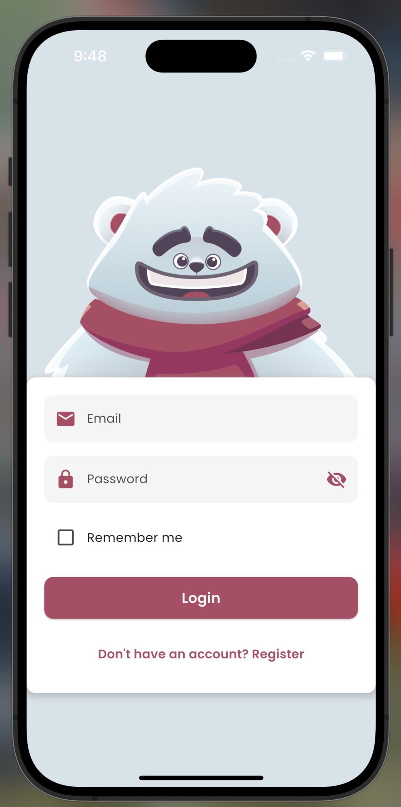
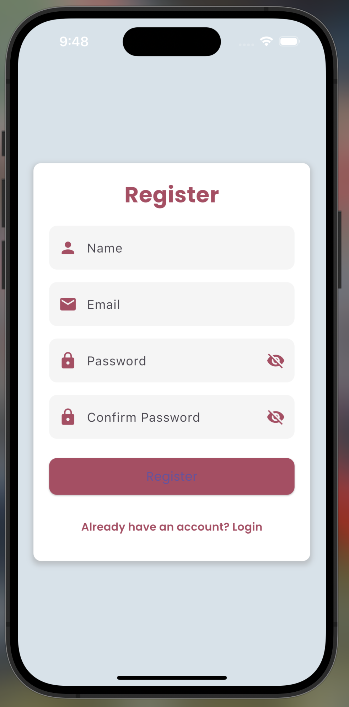
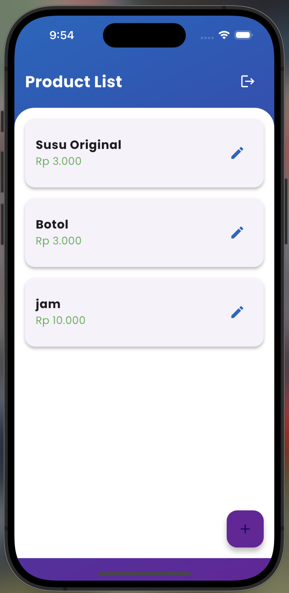
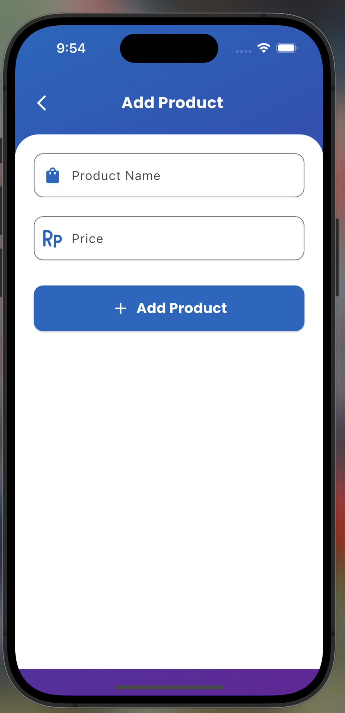

# Tugas Pertemuan 4

Nama: **Ahmad Rian Syaifullah Ritonga**  
NIM: **H1D022010**  
Shift Baru: **D**

## Getting Started Toko Application

## Highlight Code

### 1. get url form laravel

```dart
static const String apiUrl = 'http://localhost:8000/api';

```

### 2. routes api with laravel sanctum

```php
<?php

use Illuminate\Http\Request;
use Illuminate\Support\Facades\Route;
use App\Http\Controllers\ProductController;


Route::middleware('auth:sanctum')->get('/user', function (Request $request) {
    return $request->user();
});


Route::apiResource('products', ProductController::class);

```

### 3. use json

```php
public function store(Request $request)
    {
        $product = Product::create($request->all());
        return response()->json($product, 201);
    }


    public function show($id)
    {
        return Product::findOrFail($id);
    }


    public function update(Request $request, $id)
    {
        $product = Product::findOrFail($id);
        $product->update($request->all());
        return response()->json($product, 200);
    }


    public function destroy($id)
    {
        Product::destroy($id);
        return response()->json(null, 204);
    }
```

### 4. Product Service

```dart
import 'dart:convert';
import 'package:http/http.dart' as http;
import '../models/product.dart';

class ProductService {
  static const String apiUrl = 'http://localhost:8000/api/products';

  // Mendapatkan semua produk
  Future<List<Product>> getProducts() async {
    try {
      final response = await http.get(Uri.parse(apiUrl));
      if (response.statusCode == 200) {
        List jsonResponse = json.decode(response.body);
        return jsonResponse
            .map((product) => Product.fromJson(product))
            .toList();
      } else {
        throw Exception('Failed to load products');
      }
    } catch (e) {
      throw Exception('Error loading products: $e');
    }
  }

  // Membuat produk baru
  Future<Product> createProduct(Product product) async {
    try {
      final response = await http.post(
        Uri.parse(apiUrl),
        headers: {"Content-Type": "application/json"},
        body: jsonEncode(product.toJson()),
      );
      if (response.statusCode == 201) {
        return Product.fromJson(json.decode(response.body));
      } else {
        throw Exception('Failed to create product');
      }
    } catch (e) {
      throw Exception('Error creating product: $e');
    }
  }

  // Memperbarui produk
  Future<Product> updateProduct(Product product) async {
    try {
      final response = await http.put(
        Uri.parse('$apiUrl/${product.id}'),
        headers: {"Content-Type": "application/json"},
        body: jsonEncode(product.toJson()),
      );
      if (response.statusCode == 200) {
        return Product.fromJson(json.decode(response.body));
      } else {
        throw Exception('Failed to update product');
      }
    } catch (e) {
      throw Exception('Error updating product: $e');
    }
  }

  // Menghapus produk
  Future<void> deleteProduct(int id) async {
    try {
      final response = await http.delete(Uri.parse('$apiUrl/$id'));
      if (response.statusCode != 204) {
        throw Exception('Failed to delete product');
      }
    } catch (e) {
      throw Exception('Error deleting product: $e');
    }
  }
}

```

### 5. Auth Service

```dart
import 'dart:convert';
import 'package:http/http.dart' as http;
import 'package:shared_preferences/shared_preferences.dart';
import '../models/user.dart';

class AuthService {
  final String baseUrl = 'http://localhost:8000/api';

  Future<User?> register(String name, String email, String password) async {
    final response = await http.post(
      Uri.parse('$baseUrl/register'),
      headers: {'Content-Type': 'application/json'},
      body: jsonEncode({
        'name': name,
        'email': email,
        'password': password,
        'password_confirmation': password,
      }),
    );

    if (response.statusCode == 201) {
      // Corrected status code to 201
      final data = jsonDecode(response.body);
      await _saveToken(data['access_token']);
      return User.fromJson(data['user']);
    }
    return null;
  }

  Future<User?> login(String email, String password) async {
    final response = await http.post(
      Uri.parse('$baseUrl/login'),
      headers: {'Content-Type': 'application/json'},
      body: jsonEncode({
        'email': email,
        'password': password,
      }),
    );

    if (response.statusCode == 200) {
      final data = jsonDecode(response.body);
      await _saveToken(data['access_token']);
      return User.fromJson(data['user']);
    }
    return null;
  }

  Future<void> _saveToken(String token) async {
    try {
      final prefs = await SharedPreferences.getInstance();
      await prefs.setString('access_token', token);
    } catch (e) {
      print('Error saving token: $e');
    }
  }

  Future<bool> isLoggedIn() async {
    final prefs = await SharedPreferences.getInstance();
    return prefs.containsKey('access_token');
  }

  Future<String?> getToken() async {
    final prefs = await SharedPreferences.getInstance();
    return prefs.getString('access_token');
  }

  Future<void> logout() async {
    final prefs = await SharedPreferences.getInstance();
    final token = prefs.getString('access_token');

    if (token != null) {
      try {
        final response = await http.post(
          Uri.parse('$baseUrl/logout'),
          headers: {
            'Content-Type': 'application/json',
            'Authorization': 'Bearer $token',
          },
        );

        if (response.statusCode == 200) {
          // Hapus token setelah logout
          await prefs.remove('access_token');
        } else {
          print('Error during logout: ${response.body}');
        }
      } catch (e) {
        print('Error during logout: $e');
      }
    }
  }
}

```

## Screenshots

<div style="display: flex; flex-wrap: wrap; gap: 10px; justify-content: space-between;">

  
  
  
  
  
  
  
</div>
