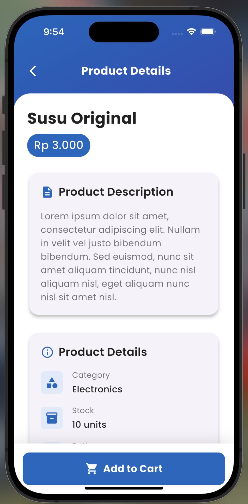

# Tugas Pertemuan 4

Nama: **Ahmad Rian Syaifullah Ritonga**  
NIM: **H1D022010**  
Shift Baru: **D**

## Getting Started Toko Application

## Highlight Code

### 1. get url form laravel

```dart
static const String apiUrl = 'http://localhost:8000/api/products';
```

### 2. routes api with laravel sanctum

```php
<?php

use Illuminate\Http\Request;
use Illuminate\Support\Facades\Route;
use App\Http\Controllers\ProductController;


Route::middleware('auth:sanctum')->get('/user', function (Request $request) {
    return $request->user();
});


Route::apiResource('products', ProductController::class);

```

### 3. use json

```php
public function store(Request $request)
    {
        $product = Product::create($request->all());
        return response()->json($product, 201);
    }


    public function show($id)
    {
        return Product::findOrFail($id);
    }


    public function update(Request $request, $id)
    {
        $product = Product::findOrFail($id);
        $product->update($request->all());
        return response()->json($product, 200);
    }


    public function destroy($id)
    {
        Product::destroy($id);
        return response()->json(null, 204);
    }
```

## Screenshots

<div style="display: flex; flex-wrap: wrap; gap: 10px; justify-content: space-between;">
  
  
  
  
  
  
</div>
